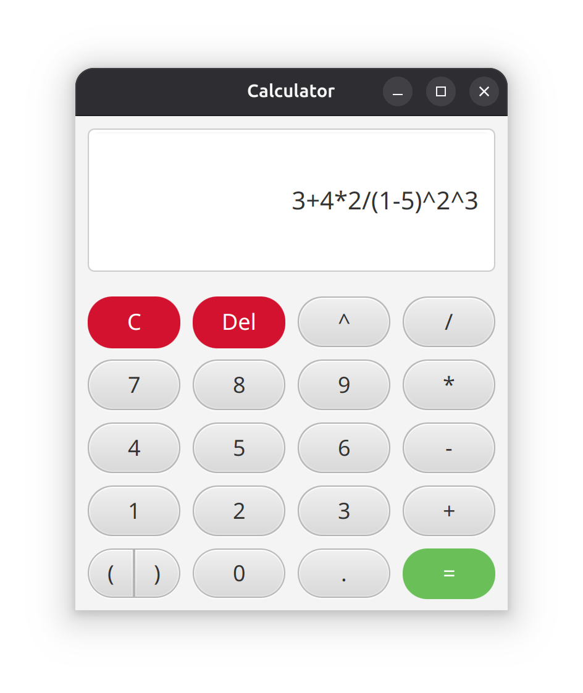

# JavaCalc

A basic Java calculator program. Made in JavaFX.

# Showcase


# Install
Installing this calculator can be a little bit complicated, since it is a Java app.

## Prerequisities
We will need java, and a few other depedencies.

```bash
# Ubuntu
sudo apt install default-jre default-jdk maven git
```

Now, we can work on obtaining the code.
```bash
git clone https://github.com/EveMeows/JavaCalc.git
cd JavaCalc/
```

Now, we can install the app.
```bash
# We can just run the app by typing the following:
mvn clean package javafx:run

# Using shade, we can package it as a JAR.

# Clean the target.
mvn clean

# Build the fat jar.
mvn install

cd target/
java -jar ./JavaCalc-<VERSION>-shaded.jar

# OR, we can use jlink.
mvn clean javafx:jlink
cd target/

jpackage --name JavaCalc --main-class xyz.itseve.javacalc.Entry --module xyz.itseve.javacalc/xyz.itseve.javacalc.Entry --runtime-image app/ --type app-image

cd JavaCalc/bin/
./JavaCalc
```

# License
GPL 3.0